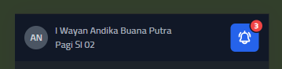
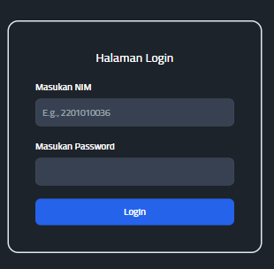
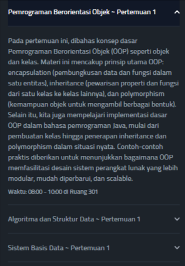

# Basic Web Project with HTML, CSS, JS, and Tailwind

## Overview
This is a basic web project built using HTML, CSS, JavaScript, and Tailwind CSS. It utilizes CDN links for fast setup and ease of use. The project is a simple starting point for building responsive web pages quickly and efficiently.

## Features
- Responsive design using Tailwind CSS via CDN
- Simple and modular HTML structure
- JavaScript for interactivity

## Technologies Used
- **HTML5**: For the basic structure of the website.
- **CSS3**: Basic styling, integrated with Tailwind CSS via CDN.
- **JavaScript (ES6)**: For client-side interactivity and DOM manipulation.
- **[Tailwind CSS CDN](https://cdn.tailwindcss.com/)**: A utility-first CSS framework for quickly styling components without installation.

## Usage
You can simply open the `index.html` file in your browser after downloading or cloning the project. No need for build tools or installation steps since it uses CDN links.

## Step by Step to build the website
- Build the structure of the website using HTML
- Style the website using Tailwing CSS and if necessary use the custom styles (like the font type; here i use XDPrime in the CSS file)
- It use JSON for the data structure. Also use custom JavaScript for the interactivity using DOM.
- If want to change the primary color of the website, look at this section:
    ```javascript
    <script>
        tailwind.config = {
          theme: {
            extend: {
              colors: {
                primary: '#2563EB',
              }
            }
          }
        }
      </script>

## Components of the Website
### 1. Navbar Component


```html
<nav class="bg-white border-gray-200 dark:bg-gray-900 fixed w-full top-0 z-50">
    ....
</nav>
```

This component build with \<nav> element with posisition is fixed, so when the page is scrolled, it will in the same position.

```html
<div class="max-w-screen-xl flex flex-wrap items-center justify-between mx-auto p-4">
    ....
    ....
</div>
```

And this element have \<div> as the child element, display of this element is flex, with the ``` justify-content:space-between```, it makes the space of the element \<a> at the left with the element \<div> at the right will always same in desktop mode or mobile mode.

### 2. Card Component

```html
<div class="card bg-base-100 image-full w-96 shadow-xl mx-auto mt-24">
  <figure>
    
  </figure>
  <div class="card-body flex justify-between">
      ...
  </div>
</div>
```

This component is build with \<div> element, with the children are \<figure> for the image and \<div> for the content
### 3. Class-Card Component


```html
<div class="grid justify-center my-9 container-class">
  <!-- icon next & previous -->
  <div class="grid grid-cols-2 justify-between gap-4 w-96 lg:w-full">
      ...
  </div>
  <!-- card with appear here with JavaScript -->
  ...
</div>
```

This section was build with \<div> element with the display is grid, because it have 2 children: for icon previous and next sections and with the card component. 

```javascript
const todayClass=document.createElement('div');
todayClass.classList.add('grid','grid-cols-2','justify-between','gap-4','w-96', 'lg:w-full','mt-3','today-class');
....
todayClass.innerHTML=`
  ${first}
  ${second}
`;
containerClass.appendChild(todayClass);
```

And for the card will append with Javascript in [script.js](./script/script.js)
### 4. Form Login Component


```html
<div class="mx-auto mt-24">
    <form class="max-w-sm mx-auto border-solid border-2 border-gray-200 p-10 rounded-2xl">
        ....
        <button type="submit" class="...">
            <a href="home.html">Login</a>
        </button>
    </form>
</div>
```

This component is basic form login, because it is just for simple front-end project, so for the action and method is default. And when user click login button, it will redirect to homepage with \<a> element.
### 5. List-Notification Component


```html
<div class="mt-24 m-5">
    <div id="accordion-flush" data-accordion="collapse" data-active-classes="bg-white dark:bg-gray-900 text-gray-900 dark:text-white" data-inactive-classes="text-gray-500 dark:text-gray-400">
        <div class="list-materi">
            <!-- The data will be shown here with JS -->
        </div>   
    </div>
</div>
```

This section was build with accordition UI, first it will just show a little bit information, when user click something, the details of the information will be shown.

```javascript
 const listMateri = document.querySelector('.list-materi');
    data.kelas.forEach((kelas, index) => {
      // Notifikasi
      const containerMateri = document.createElement('div');
      ........
      listMateri.appendChild(containerMateri);
    });
```

And for the data will process in [notification_script.js](./script/notification_script.js)